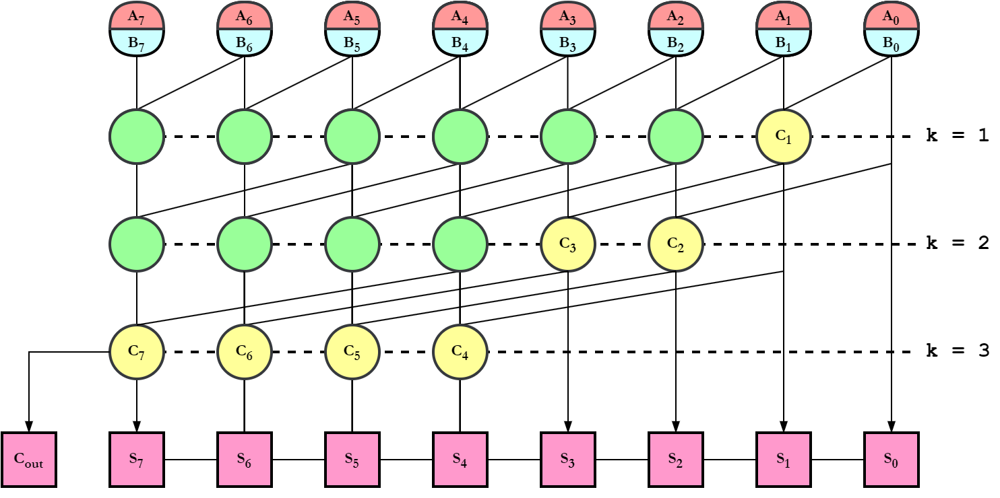

# Generic, Synthesizable Kogge-Stone Adder Implementation #

As a side-project I started digging a bit into the arithmetic circuits, in the context of generating a new, faster version of [Tethorax](https://github.com/NikosDelijohn/Tethorax) in Verilog. The ripple-carry adder currently implemented in the core is a prime candidate for changing since its one of the slowest adders posible. So after reading about the PPAs I bumped into the Kogge-Stone adder (KSA) and here we are.

## Why this specific KSA? ## 

You can find many designs online (e.g., [[1](https://github.com/jeremytregunna/ksa)], [[2](https://github.com/rohansharmaa/KoggeStoneAdder-Verilog)], [[3](https://github.com/gubbriaco/VHDL_scripts)], ...) which however are of **fixed** precision and follow a somewhat structural (non-behavioral) design. This KSA was developed with the purpose of being a standalone, completely modular adder in terms of precision (and synthesizable).

## Theory & Implementation

A KSA of n-bits precision is comprised of $log_2(n)$ generate (G) and propagate (P) computation levels. For instance, a KSA of 8-bits precision KSA would have $log2(8) = 3$ P&G computation steps.



A KSA is done computing when all carry bit possition ($C_i$) values have been computed. The general formula for a carry bit at position $i$ is given as:

$$
C_i = G_i + \sum_{j = 0}^{i-1} \left( \prod_{k=j+1}^{i} P_k\right) \times G_j
$$

This means that:
- either the carry is generated at the current stage $i \rightarrow G_i$
- or the carry is generated at some previous stage $j \rightarrow G_j$ and is propagated up to position $i \rightarrow P_k$

For instance, let us compute $C_2$:

$$
C_2 = G_2 + P_2G_1 + P_1P_2G_0
$$

In the figure above, each circle for the levels k=1 up to k=3 represents a dot operator (see [α] for more info). However, the dot operators come in two variants (colored in green/yellow). The green variant produces a G and a P value, with inputs comming directly from the previous level (k-1). The yellow variant produces only a G value and marks the completion of the computation of the respective carry bit $i$.

In a n-bit KSA, with $log_2(n) = k$ levels, **for each level** we have:

- the generation of $n \rightarrow$ G values
- the generation of $n - 2^{k} \rightarrow$ P values


Hence, in total, we have:

- $k \times n \rightarrow$ G values
- $k \times n - (n + 2) \rightarrow$ P values 

These numbers can be trivially verified by counting the number of P and G statements in various precision KSA implementations (see [β]). 

However, albeit the number of G values is the $n$ for every level $k$, the number of P values is not static (green circles). Which means, that in order to have a modular **and synthesizable** KSA design, we cannot use dynamic arrays to store the P values. Hence, we consider that in every stage we generate $n$ P values too, however the P values for indices $i < 2^k$ are set to `1b'0` and remain unused. 

After all $C_i$ bits are available, the computation is complete and we generate the sum bits ($S_i$) as:

$$
S_0 = P_{0,0} 
$$

$$
S_i = P_{i,0} \oplus G_{i-1, \ log_2(n)}
$$

The first subscript corresponds to the bit index whereas the second subscript corresponds to the level k of the computation. 
> Reminder: $log_2(n)$ gives the total number of steps k.

Lastly, the $C_{out}$ (which is the overflow output of the unit) is `1` if a carry is generated in the most significant bit location at the final computation level k. That is, $G_{msb,\ log_2(n)}$.


## Testbench

A testbench is also provided. You can modify the total number of tests you wish to perform by altering the parameter `NUMBER_OF_TESTS` and also the KSA's precision by modifying the parameter `PRECISION`. The testbench implements a somewhat fuzzing approach by generating random integers and feeding them to the KSA, while checking for each operand pair whether the result is the expected one.

The design can be compiled and executed using the simulator of your choice. I am using Icarus verilog as:
```
# Compilation
iverilog -g2005-sv kogge_stone_adder.sv tb.sv -o ksa
# Execution
vvp ksa
# Exit vvp
finish
```

## Citation
You can cite this design by using the following @misc entry in Bibtex

```
@misc{misc:ksa,
    author       = "{Deligiannis, I. Nikolaos}",
    title        = "{A Verilog KSA Implementation with Modular Precision.}",
    howpublished = "\url{https://github.com/NikosDelijohn/ksa}",
    year         = "2024"
}
```

## References

**[ α ]** Abbas, K. (2020). Arithmetic. In: Handbook of Digital CMOS Technology, Circuits, and Systems. Springer, Cham. https://doi.org/10.1007/978-3-030-37195-1_11

**[ β ]** Kogge–Stone Adder. In Wikipedia. https://en.wikipedia.org/wiki/Kogge%E2%80%93Stone_adder
